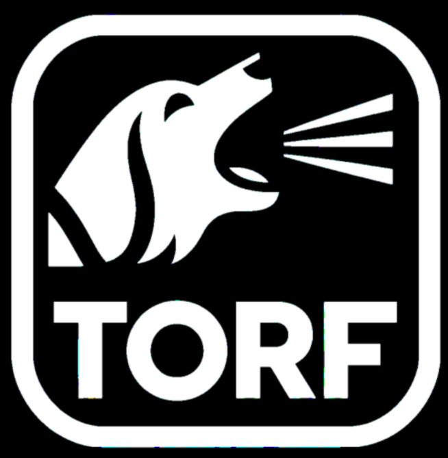

R Tools for Obspack, Receptors and Footprints (rtorf)
================




[](https://github.com/noaa-gml/rtorf/actions/workflows/R-CMD-check.yaml)


[NOAA Obspack](https://gml.noaa.gov/ccgg/obspack/) is a collection of
greenhouse gases observations

`rtorf` only depends on `data.table` and `ncdf4`, which is basically
parallel C, so it can be installed in any machine.

## Installation

Using git bash/powershell

``` bash
git clone https://github.com/noaa-gml/rtorf
R CMD INSTALL rtorf
```

Using remotes R package

``` r
remotes::install_github("noaa-gml/rtorf")
```

``` r
library(rtorf)
library(data.table)
```

## ObsPack summary

The first step consists in constructing a summary for the ObsPack. This
is required to read the data, but also, identify `agl`, which is present
in some of the file names. This function returns a `data.frame`.
Optionally, the user can indicate a path to store the `data.frame`.
`obs_summary` also prints a summary of the data. The second argument is
the categories, and by default includes the categories shown below, to
account for all the files. Then the summary `data.frame` contains the
columns `id` as the full path to each file, `name` which is the name or
relative path of the file, `n` just an id, `sector` such as tower, and
the column `agl` which indicates the `agl` indicated in the name of the
file if available. To read the documentation of this function, the user
must run `?obs_summary`.

> We first define the categories

``` r
cate = c("aircraft-pfp",
         "aircraft-insitu",
         "aircraft-flask",
         "surface-insitu",
         "surface-flask", 
         "surface-pfp",   
         "tower-insitu",  
         "aircore",       
         "shipboard-insitu",
         "shipboard-flask") 

obs <- "Z:/torf/obspack_ch4_1_GLOBALVIEWplus_v5.1_2023-03-08/data/nc/"
index <- obs_summary(obs = obs, categories = cate)
```

    ## Number of files of index: 0
    ##           sector     N
    ##           <char> <int>
    ## 1: Total sectors     0
    ## Detected 0 files with agl
    ## Detected 0 files without agl

For each one of these dataset ids, check the articles in the
documentation

<https://noaa-gml.github.io/rtorf/>

## Implementation in python:

I’m currently implementing a version in python
[pytorf](https://github.com/noaa-gml/pytorf):

| R                  | description                                     | Python |
|:-------------------|:------------------------------------------------|:-------|
| fex                | File extension                                  |        |
| invfile            | Methods for objects with class ‘invfile’        |        |
| obs_addltime       | local hour (bsed on longitude and time)         |        |
| obs_addstime       | Add solar time into obspack                     |        |
| obs_addtime        | Add times into obspack                          |        |
| obs_agg            | Aggregates ObsPack by time                      |        |
| obs_find_receptors | Compares expected receptors                     |        |
| obs_footname       | Expected footprint name                         |        |
| obs_format         | Formatting data                                 |        |
| obs_freq           | return numeric vector in intervals              |        |
| obs_index          | Summary of the ObsPack files (.txt)             | OK     |
| obs_invfiles       | Generate files to perform inverse modeling      |        |
| obs_list.dt        | list.dt                                         |        |
| obs_meta           | Read obspack metadata                           |        |
| obs_out            | outersect                                       |        |
| obs_plot           | Read obspack metadata                           |        |
| obs_rbind          | rbind obspack                                   |        |
| obs_read           | Read obspack (.txt)                             |        |
| obs_read_csvy      | reads CSVY                                      |        |
| obs_read_nc        | Read obspack (.nc)                              | OK     |
| obs_roundtime      | round seconds from “POSIXct” “POSIXt” classes   |        |
| obs_summary        | Summary of the ObsPack files (.txt)             |        |
| obs_table          | Obspack Table                                   |        |
| obs_trunc          | Trunc numbers with a desired number of decimals |        |
| obs_write_csvy     | Generates YAML and write data.frame             |        |
| plot.invfile       | Methods for objects with class ‘invfile’        |        |
| print.invfile      | Methods for objects with class ‘invfile’        |        |
| sr                 | Extacts n last characters                       |        |
| summary.invfile    | Methods for objects with class ’invfile         |        |

## Special thanks to all the contributors

[](https://github.com/noaa-gml/rtorf/graphs/contributors)
