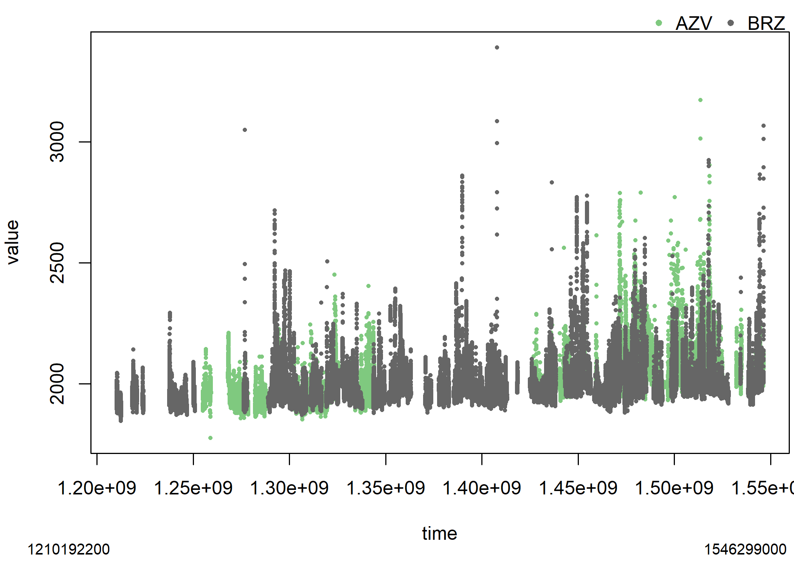

R Tools for Obspack, Footprints and Receptors (rtorf)
================


[](https://github.com/ibarraespinosa/rtorf/actions)
[](https://github.com/ibarraespinosa/rtorf/actions)

[NOAA Obspack](https://gml.noaa.gov/ccgg/obspack/) is a collection of
green house gases observations

`rtorf` only depends on `data.table`, which is basically parallel C, so
it can be installed in any machine.

## installation

``` r
remotes::install_github("ibarraespinosa/rtorf")
```

``` r
library(rtorf)
library(data.table)
```

## ObsPack summary

The first step consists in constructing a summary for the ObsPack. This
is required to read the data, but also, identify `agl`, which is present
in some of the file names. This function returns a `data.frame`.
Optionally, the user can indicate a path to store the `data.frame`.
`obs_summary` also prints a summary of the data. The second argument is
the categories, and by default includes the categories shown below, to
account for all the files. Then the summary `data.frame` contains the
columns `id` as the full path to each file, `name` which is the name or
relative path of the file, `n` just an id, `sector` such as tower, and
the column `agl` which indicates the `agl` indicated in the name of the
file if available. To read the documentation of this function, the user
must run `?obs_summary`.

``` r
categories <- c(
  "aircraft-pfp",
  "aircraft-insitu",
  "surface-insitu",
  "aircore",
  "surface-pfp",
  "tower-insitu",
  "shipboard-insitu",
  "flask"
)
obs <- "../../obspack_ch4_1_GLOBALVIEWplus_v4.0_2021-10-14/data/txt"
index <- obs_summary(obs = obs)
```

    ## Number of files of index: 362
    ##              sector   N
    ## 1:     aircraft-pfp  40
    ## 2:  aircraft-insitu  11
    ## 3:            flask 101
    ## 4:   surface-insitu 124
    ## 5:          aircore   1
    ## 6:      surface-pfp  33
    ## 7:     tower-insitu  51
    ## 8: shipboard-insitu   1
    ## 9:    Total sectors 362
    ## Detected 147 files with agl
    ## Detected 215 files without agl

There are 362 files in the ObsPack directory. The printed information
also shows the total at the bottom, as the sum of the individual file by
sector. This is to ensure that the sum of files is equal to the total
number of files found, shown at the top. furthermore, the printed
information also shows that there are 136 files with the `agl`
explicitly mentioned in the name of the file.

Sometimes we need more information about the site. For instance, what do
the observations start and end. Then, we added the function `obs_table`,
which calculates statistics summary of “time” and other numeric
variables by file name, sector, site, altitude and mode. For instance,
the observations in the site “SCT” in South Carolina, USA, were between
“2015-08-19 21:30:00 UTC” and “2020-12-31 23:30:00 UTC”.

``` r
dft <- obs_table(index = index,
                 categories = "tower-insitu",
                 verbose = FALSE)
dft[site_code == "SCT", ]$timeUTC |> 
  range()
```

    ## [1] "2015-08-19 21:30:00 UTC" "2020-12-31 23:30:00 UTC"

### Read data

Once the summary is built, the function `obs_read` will read the files
available in the index file previously generated. Here we selected the
category “tower-insitu”. The argument verbose prints which files are
being read each time, by default. At the end, this function prints the
total number of observations by type of altitude (agl or asl).

``` r
df <- obs_read(index = index,
               categories = "tower-insitu",
               verbose = FALSE)
```

We added a function to plot the data read from ObsPack. The y-axis is
the field `value` and the x-axis is by default `time`. The data
illustrated sorted by color is the field `site_code`, with the default
number of 3 sites. The argument `pal` is to define the color palette,
used by the internally imported function `cptcity::cpt`.

``` r
obs_plot(dt = df, time = "time", yfactor = 1e+09, cex = 0.5)
```

    ## Found the following sites: 
    ##  [1] AZV   BRZ   BSD   CRV   DEM   DVV   GCI01 GCI02 GCI03 GCI04 HUN   IGR  
    ## [13] KRS   LEF   MRC   NOY   RGL   SCT   SVV   TAC   VGN   WGC   WSD   YAK  
    ## Plotting the following sites: 
    ## [1] AZV BRZ

<figure>

<figcaption aria-hidden="true">First two sites in ObsPack</figcaption>
</figure>

Here we can see 2.32 million observations for `tower-insitu`. These
observations are made between 2004 and 2020. The identification of the
altitude and type is critical. The approach used here consists of:

1.  Identify `agl` from the name of the tile.
2.  If `agl` not present, search fill_values used in elevation and
    transform them into NA (not available)
3.  If `agl` is not present, `agl = altitude - elevation`.
4.  If there are some NA in elevation, will result some NA in `agl`
5.  A new column is added named `altitude_final` to store `agl` or `asl`
6.  Another column named `type_altitude` is added to identify `agl` or
    `asl`.
7.  If there is any case NA in `altitude_final`, `type_altitude` is “not
    available”

### Filtering

ObsPack includes global observations and sometimes we need to extract
data for a specific region and periods of time. In this part we include
spatial and temporal parameters to filter data. The year of interest is
2020, but we also included December of 2019 and January of 2021. At this
stage, we can apply the spatial filter by using the coordinates.

``` r
north <- 80
south <- 10
west <- -170
east <- -50
max_altitude <- 8000
evening <- 14:15

yy <- 2020
df <- rbind(df[year == yy - 1 & month == 12],
            df[year == yy],
            df[year == yy + 1 & month == 1])

df <- df[altitude_final < max_altitude &
           latitude < north &
           latitude > south &
           longitude < east &
           longitude > west]
```

After filtering by space and time, we have 1.0487^{5} million
observations. Towers can have observations at different heights. Here we
need to select one site with the observations registered at the highest
height. The column with the height is named `altitude_final` and the max
altitude was named `max_altitude`.

``` r
dfa <- df[,
          max(altitude_final),
          by = site_code] |> unique()

names(dfa)[2] <- "max_altitude"
```

### Time

Here we need to start time columns. The function `obs_addtime` adds time
columns `timeUTC`, `timeUTC_start` which shows the start time of each
observation and `timeUTC_end` which shows the end time for each
observation. Then we need to identify the local time with the function
`add_ltime`. This is important because to identifying observations in
the evening in local time. `add_ltime` uses two methods, first identify
the time difference with utc by identifying the metadata column
“site_utc2lst”. If this information is not available, with the aircrafts
for instance, the local time is calculated with an approximation based
on longitude:

$$
lt = UTC + longitude/15 * 60 * 60
$$ Where $lt$ is the local time, $UTC$ the time, $longitude$ the
coordinate. Then, the time is cut every two hours. Now, we identify the
local time to select evening hours.

``` r
df2 <- obs_addtime(df)
```

    ## Adding timeUTC
    ## Adding timeUTC_start
    ## Adding timeUTC_end
    ## Found time_interval

``` r
df2$timeUTC <- cut(x = df2$timeUTC+3600,
                   breaks = "2 hour") |>
  as.character() |>
  as.POSIXct(tz = "UTC")
df3 <- obs_addltime(df2)
```

    ## Found site_utc2lst

``` r
df3 <- df3[lh %in% evening]
```

Now there are 8391 observations. At this point we can calculate the
averages of several columns by the cut time. The function `obs_agg` does
this aggregation as shown in the following lines of code. The argument
`gby` establish the function used to aggregate `cols`, in this case the
function mean by time and altitude. Finally, we add local time again.

``` r
df4 <- obs_agg(dt = df3,
               gby = "mean",
               cols = c("value",
                        "latitude",
                        "longitude",
                        "type_altitude",
                        "dif_time",
                        "year_end",
                        "site_utc2lst"),
               verbose = FALSE,
               byalt = TRUE)
```

    ## Detecting dif_time. Adding ending times

``` r
df5 <- obs_addltime(df4)
```

    ## Found site_utc2lst

Now there are 4394 observations, 3997 less observations. Here we add the
column `max_altitude` to identify the max altitude by site.

``` r
df5[,
    max_altitude := max(altitude_final),
    by = site_code]
df5[,
    c("site_code",
      "altitude_final",
      "max_altitude")] |> unique()
```

    ##     site_code altitude_final max_altitude
    ##  1:       CRV             17           32
    ##  2:       CRV             32           32
    ##  3:       CRV              5           32
    ##  4:       LEF            122          396
    ##  5:       LEF             30          396
    ##  6:       LEF            396          396
    ##  7:       SCT            305          305
    ##  8:       SCT             31          305
    ##  9:       SCT             61          305
    ## 10:       WGC             30          483
    ## 11:       WGC            483          483
    ## 12:       WGC             91          483

### Saving master as text and csvy

Now that we have all the required information, we can save the files.
Here, we name the data.frame as master, because it contains all the
information. This is important because some fields can be used in the
future, and for traceability. For convenience, time variables are
transformed into character before writing into the disk. The separation
is space ” “.

``` r
tmp <- tempfile()
master <- df5
master$timeUTC <- as.character(master$timeUTC)
master$timeUTC_end <- as.character(master$timeUTC_end)
master$local_time <- as.character(master$local_time)

fwrite(master, 
       file =  "paper/tower_insitu_2020.txt",
       sep = " ")
```

The format Comma Separated Value with YAML (CSVY)\[^3\] consists in a
typical CSV with a YAML header. The function`obs_write_csvy` includes
the argument `notes` which allows adding custom notes at the header of
the file. Below the notes, `obs_write_csvy` adds the output of the R
function `str`, which provides a vertical summary of the data, known as
structure.

``` r
obs_write_csvy(dt = master,
          notes = "tower 2020",
          out = "paper/tower_insitu_2020.csvy")
```

To check the YAML header we read the first 38 lines of the files that
were generated. Here we can see the column names, type of data and first
observations. The YAML header is delimited by the characters “—”.

``` r
readLines("paper/tower_insitu_2020.csvy")[1:38]
```

### Saving receptors

We need to filter some columns from the master files in a new object
called receptors. This is needed because internally we run HYSPLIT
\[@hy\] using the information from the receptors. In the case of a
tower, we need to select observations with the highest altitude. The
specific columns are selected as shown on the following code. We are
selecting the ending times, because later HYSPLIT is run backwards based
on the time of measurement, between ending and starting times. The
columns about time are formatted to have two characters. For instance,
the month 1, is formatted as “01”. We also need to filter for
`type_altitude` equal 0, representing `agl`observations , or equal to 1,
`asl`.

``` r
receptor <- master[altitude_final == max_altitude,
                   c("site_code",
                     "year",
                     "month",
                     "day",
                     "hour",
                     "minute",
                     "second",
                     "latitude",
                     "longitude",
                     "altitude_final",
                     "type_altitude",
                     "year_end",
                     "month_end",
                     "day_end",
                     "hour_end",
                     "minute_end",
                     "second_end")]
receptor$altitude_final <- round(receptor$altitude_final)
receptor <- obs_format(receptor)

if(nrow(receptor_agl) > 0) {
  fwrite(x = receptor_agl,
         file = "paper/receptor_tower_insitu_2020_AGL.txt"),
  sep = " ")}

if(nrow(receptor_asl) > 0) {
  fwrite(x = receptor_asl,
         file = "paper/receptor_tower_insitu_2020_ASL.txt"),
  sep = " ")}
```

## Recommendation for other applications

The approach to generate receptors depends on each type of observation
and other considerations. For instance, aircraft with continuous
observations at each second can be filtered and averaged every 20
seconds. In that way, the footprints are still representative and it
would not be necessary to run HYSPLIT every second. Of course, it
depends on the application and objective of the study. For this
manuscript, we are presenting the generation of receptors based on tower
observations.

## Application for other sectors

In this package we are sharing scripts to process other sectors The
scripts are available in the path
`https://github.com/ibarraespinosa/rtorf/tree/main/rscripts`
