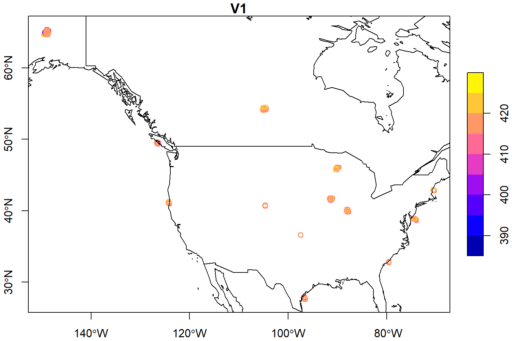
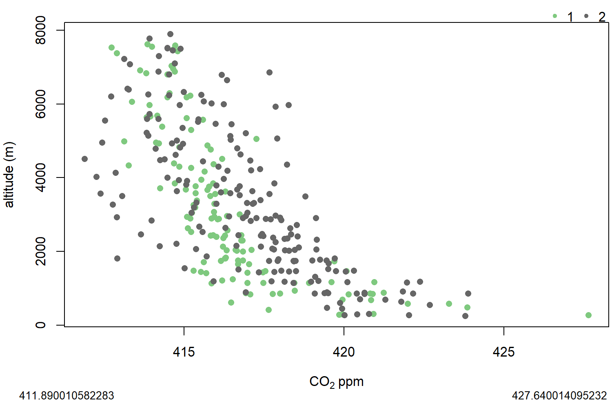

```{r, include = FALSE}
knitr::opts_chunk$set(
  collapse = TRUE,
  comment = "#>"
)
```

```{r setup}
library(rtorf)
library(data.table)
```


```{r read1, eval = F}

cate = c("aircraft-pfp",
         "aircraft-insitu",
         "aircraft-flask",
         "surface-insitu",
         "surface-flask", 
         "surface-pfp",   
         "tower-insitu",  
         "aircore",       
         "shipboard-insitu",
         "shipboard-flask") 

obsch4 <- "Z:/obspack/obspack_ch4_1_GLOBALVIEWplus_v5.1_2023-03-08/data/nc/"
indexch4 <- obs_summary(obs = obsch4, 
                     categories = cate)
```
```
Number of files of index: 479
              sector     N
              <char> <int>
 1:     aircraft-pfp    42
 2:  aircraft-insitu    17
 3:    surface-flask   106
 4:   surface-insitu   121
 5:   aircraft-flask     4
 6:          aircore     1
 7:      surface-pfp    33
 8:     tower-insitu   150
 9:  shipboard-flask     4
10: shipboard-insitu     1
11:    Total sectors   479
Detected 203 files with agl
Detected 276 files without agl
```


```{r read2, eval = F}
obsco2 <- "Z:/obspack/obspack_co2_1_GLOBALVIEWplus_v9.1_2023-12-08/data/nc/"
indexco2 <- obs_summary(obs = obsco2, 
                        categories = cate)
```

```
Number of files of index: 617
              sector     N
              <char> <int>
1:   surface-insitu   160
2:     aircraft-pfp    41
3:  aircraft-insitu    41
4:    surface-flask   138
5: shipboard-insitu    14
6:   aircraft-flask     6
7:          aircore     1
8:      surface-pfp    29
9:     tower-insitu   183
10:  shipboard-flask     4
11:    Total sectors   617
Detected 231 files with agl
Detected 386 files without agl
```

We can merge co2 and ch4

```{r eval = F}
index <- rbind(indexch4,
               indexco2)
```


Now we read the `aircraft-pfp` using the function `obs_read_nc`. To this date,
`solar_time` is not included for aircraft, so we `FALSE` that argument.

```{r readnc, eval = F}
datasetid <- "aircraft-pfp"
df <- obs_read_nc(index = index,
                  categories = datasetid,
                  solar_time = FALSE,
                  verbose = T)

```
```
Searching aircraft-pfp...
1: ch4_aao_aircraft-pfp_1_allvalid.nc
2: ch4_acg_aircraft-pfp_1_allvalid.nc
3: ch4_act_aircraft-pfp_1_allvalid-b200.nc
4: ch4_act_aircraft-pfp_1_allvalid-c130.nc
5: ch4_alf_aircraft-pfp_26_representative.nc
6: ch4_bgi_aircraft-pfp_1_allvalid.nc
7: ch4_bne_aircraft-pfp_1_allvalid.nc
8: ch4_car_aircraft-pfp_1_allvalid.nc
9: ch4_cma_aircraft-pfp_1_allvalid.nc
10: ch4_crv_aircraft-pfp_1_allvalid.nc
11: ch4_dnd_aircraft-pfp_1_allvalid.nc
12: ch4_esp_aircraft-pfp_1_allvalid.nc
13: ch4_etl_aircraft-pfp_1_allvalid.nc
14: ch4_ftl_aircraft-pfp_1_allvalid.nc
15: ch4_fwi_aircraft-pfp_1_allvalid.nc
16: ch4_haa_aircraft-pfp_1_allvalid.nc
17: ch4_hfm_aircraft-pfp_1_allvalid.nc
18: ch4_hil_aircraft-pfp_1_allvalid.nc
19: ch4_hip_aircraft-pfp_1_allvalid.nc
20: ch4_inx_aircraft-pfp_1_allvalid.nc
21: ch4_lef_aircraft-pfp_1_allvalid.nc
22: ch4_man_aircraft-pfp_26_representative.nc
23: ch4_mci_aircraft-pfp_1_allvalid.nc
24: ch4_mrc_aircraft-pfp_1_allvalid.nc
25: ch4_nha_aircraft-pfp_1_allvalid.nc
26: ch4_oil_aircraft-pfp_1_allvalid.nc
27: ch4_pfa_aircraft-pfp_1_allvalid.nc
28: ch4_rba-b_aircraft-pfp_26_representative.nc
29: ch4_rta_aircraft-pfp_1_allvalid.nc
30: ch4_sah_aircraft-pfp_26_representative.nc
31: ch4_sam_aircraft-pfp_1_allvalid.nc
32: ch4_san_aircraft-pfp_1_allvalid.nc
33: ch4_san_aircraft-pfp_26_representative.nc
34: ch4_sca_aircraft-pfp_1_allvalid.nc
35: ch4_sgp_aircraft-pfp_1_allvalid.nc
36: ch4_tab_aircraft-pfp_26_representative.nc
37: ch4_tgc_aircraft-pfp_1_allvalid.nc
38: ch4_thd_aircraft-pfp_1_allvalid.nc
39: ch4_ulb_aircraft-pfp_1_allvalid.nc
40: ch4_wbi_aircraft-pfp_1_allvalid.nc
41: co2_aao_aircraft-pfp_1_allvalid.nc
42: co2_above_aircraft-pfp_1_allvalid.nc
43: co2_acg_aircraft-pfp_1_allvalid.nc
44: co2_act_aircraft-pfp_1_allvalid-b200.nc
45: co2_act_aircraft-pfp_1_allvalid-c130.nc
46: co2_alf_aircraft-pfp_433_representative.nc
47: co2_bgi_aircraft-pfp_1_allvalid.nc
48: co2_bne_aircraft-pfp_1_allvalid.nc
49: co2_car_aircraft-pfp_1_allvalid.nc
50: co2_cma_aircraft-pfp_1_allvalid.nc
51: co2_cob_aircraft-pfp_1_allvalid.nc
52: co2_crv_aircraft-pfp_1_allvalid.nc
53: co2_dnd_aircraft-pfp_1_allvalid.nc
54: co2_esp_aircraft-pfp_1_allvalid.nc
55: co2_etl_aircraft-pfp_1_allvalid.nc
56: co2_ftl_aircraft-pfp_1_allvalid.nc
57: co2_fwi_aircraft-pfp_1_allvalid.nc
58: co2_haa_aircraft-pfp_1_allvalid.nc
59: co2_hfm_aircraft-pfp_1_allvalid.nc
60: co2_hil_aircraft-pfp_1_allvalid.nc
61: co2_inx_aircraft-pfp_1_allvalid.nc
62: co2_lef_aircraft-pfp_1_allvalid.nc
63: co2_mci_aircraft-pfp_1_allvalid.nc
64: co2_mrc_aircraft-pfp_1_allvalid.nc
65: co2_nha_aircraft-pfp_1_allvalid.nc
66: co2_oil_aircraft-pfp_1_allvalid.nc
67: co2_pan_aircraft-pfp_433_representative.nc
68: co2_pfa_aircraft-pfp_1_allvalid.nc
69: co2_rba-b_aircraft-pfp_433_representative.nc
70: co2_rta_aircraft-pfp_1_allvalid.nc
71: co2_sam_aircraft-pfp_1_allvalid.nc
72: co2_san_aircraft-pfp_1_allvalid.nc
73: co2_san_aircraft-pfp_433_representative.nc
74: co2_sca_aircraft-pfp_1_allvalid.nc
75: co2_sgp_aircraft-pfp_1_allvalid.nc
76: co2_tab_aircraft-pfp_433_representative.nc
77: co2_tef_aircraft-pfp_433_representative.nc
78: co2_tgc_aircraft-pfp_1_allvalid.nc
79: co2_thd_aircraft-pfp_1_allvalid.nc
80: co2_ulb_aircraft-pfp_1_allvalid.nc
81: co2_wbi_aircraft-pfp_1_allvalid.nc
```
Now we check the data

```{r checkdf, eval = F}
df
```

```
         year month   day  hour minute second       time start_time midpoint_time
        <int> <int> <int> <int>  <int>  <int>      <int>      <int>         <int>
     1:  2006     6     7    22     11     47 1149718307 1149718307    1149718307
     2:  2006     6     7    22     28     22 1149719302 1149719302    1149719302
     3:  2006     6     7    22     41     24 1149720084 1149720084    1149720084
     4:  2006     6     7    22     55     31 1149720931 1149720931    1149720931
     5:  2006     6     7    23     22     23 1149722543 1149722543    1149722543
    ---                                                                          
176349:  2022    12    21    19     12     27 1671649947 1671649947    1671649947
176350:  2022    12    21    19     15      1 1671650101 1671650101    1671650101
176351:  2022    12    21    19     17     32 1671650252 1671650252    1671650252
176352:  2022    12    21    19     19     55 1671650395 1671650395    1671650395
176353:  2022    12    21    19     23      3 1671650583 1671650583    1671650583
                    datetime time_decimal time_interval       value value_unc nvalue
                      <char>        <num>         <int>       <num>     <num>  <int>
     1: 2006-06-07T22:11:47Z     2006.433          3600 1.81998e-06   1.7e-09      1
     2: 2006-06-07T22:28:22Z     2006.433          3600 1.81748e-06   1.7e-09      1
     3: 2006-06-07T22:41:24Z     2006.433          3600 1.83108e-06   1.7e-09      1
     4: 2006-06-07T22:55:31Z     2006.433          3600 1.83283e-06   1.7e-09      1
     5: 2006-06-07T23:22:23Z     2006.433          3600 1.84134e-06   1.7e-09      1
    ---                                                                             
176349: 2022-12-21T19:12:27Z     2022.972          3600 4.22600e-04   4.1e-08      1
176350: 2022-12-21T19:15:01Z     2022.972          3600 4.22920e-04   4.1e-08      1
176351: 2022-12-21T19:17:32Z     2022.972          3600 4.22120e-04   4.1e-08      1
176352: 2022-12-21T19:19:55Z     2022.972          3600 4.28270e-04   4.1e-08      1
176353: 2022-12-21T19:23:03Z     2022.972          3600 4.27920e-04   4.1e-08      1
        value_std_dev latitude longitude altitude elevation intake_height qcflag
                <num>    <num>     <num>    <num>     <num>         <num> <char>
     1:            NA  40.1000  -88.5500  4758.10       210       4548.10    ...
     2:            NA  40.1000  -88.5500  3801.47       210       3591.47    ...
     3:            NA  40.1000  -88.5500  3170.38       210       2960.38    ...
     4:            NA  40.1000  -88.5500  2539.71       210       2329.71    ...
     5:            NA  40.1000  -88.5500  1905.77       210       1695.77    ...
    ---                                                                         
176349:            NA  41.7190  -91.5463  3008.99       227       2781.99    ...
176350:            NA  41.6885  -91.5333  2387.80       240       2147.80    ...
176351:            NA  41.6865  -91.3657  1763.88       230       1533.88    ...
176352:            NA  41.6935  -91.2090  1124.71       247        877.71    ...
176353:            NA  41.7063  -91.0566   950.98       219        731.98    ...
        instrument   analysis_datetime method event_number air_sample_container_id
            <char>              <char> <char>       <char>                  <char>
     1:         H4 2006-06-16T17:06:00      A       218410                 3141-01
     2:         H4 2006-06-16T17:21:00      A       218411                 3141-02
     3:         H4 2006-06-16T17:36:00      A       218412                 3141-03
     4:         H4 2006-06-16T17:51:00      A       218413                 3141-04
     5:         H4 2006-06-16T18:20:00      A       218415                 3141-06
    ---                                                                           
176349:        PC2 2023-01-03T22:20:27      R       512757                 3036-08
176350:        PC2 2023-01-03T22:35:42      R       512758                 3036-09
176351:        PC2 2023-01-03T22:50:56      R       512759                 3036-10
176352:        PC2 2023-01-03T23:06:10      R       512760                 3036-11
176353:        PC2 2023-01-03T23:21:24      R       512761                 3036-12
        obs_flag obspack_num
           <int>       <int>
     1:        1      959079
     2:        1      959080
     3:        1      959081
     4:        1      959082
     5:        1      959083
    ---                     
176349:        1     1827113
176350:        1     1827114
176351:        1     1827115
176352:        1     1827116
176353:        1     1827117
                                                                                  obspack_id
                                                                                      <char>
     1:  obspack_ch4_1_GLOBALVIEWplus_v5.1_2023-03-08~ch4_aao_aircraft-pfp_1_allvalid~959079
     2:  obspack_ch4_1_GLOBALVIEWplus_v5.1_2023-03-08~ch4_aao_aircraft-pfp_1_allvalid~959080
     3:  obspack_ch4_1_GLOBALVIEWplus_v5.1_2023-03-08~ch4_aao_aircraft-pfp_1_allvalid~959081
     4:  obspack_ch4_1_GLOBALVIEWplus_v5.1_2023-03-08~ch4_aao_aircraft-pfp_1_allvalid~959082
     5:  obspack_ch4_1_GLOBALVIEWplus_v5.1_2023-03-08~ch4_aao_aircraft-pfp_1_allvalid~959083
    ---                                                                                     
176349: obspack_co2_1_GLOBALVIEWplus_v9.1_2023-12-08~co2_wbi_aircraft-pfp_1_allvalid~1827113
176350: obspack_co2_1_GLOBALVIEWplus_v9.1_2023-12-08~co2_wbi_aircraft-pfp_1_allvalid~1827114
176351: obspack_co2_1_GLOBALVIEWplus_v9.1_2023-12-08~co2_wbi_aircraft-pfp_1_allvalid~1827115
176352: obspack_co2_1_GLOBALVIEWplus_v9.1_2023-12-08~co2_wbi_aircraft-pfp_1_allvalid~1827116
176353: obspack_co2_1_GLOBALVIEWplus_v9.1_2023-12-08~co2_wbi_aircraft-pfp_1_allvalid~1827117
        unique_sample_location_num          scale site_elevation_unit dataset_project
                             <int>         <char>              <char>          <char>
     1:                    2718218 WMO CH4 X2004A                masl    aircraft-pfp
     2:                    2718192 WMO CH4 X2004A                masl    aircraft-pfp
     3:                    2718174 WMO CH4 X2004A                masl    aircraft-pfp
     4:                    2718138 WMO CH4 X2004A                masl    aircraft-pfp
     5:                    2718094 WMO CH4 X2004A                masl    aircraft-pfp
    ---                                                                              
176349:                   55771244  WMO CO2 X2019                masl    aircraft-pfp
176350:                   55771219  WMO CO2 X2019                masl    aircraft-pfp
176351:                   55771217  WMO CO2 X2019                masl    aircraft-pfp
176352:                   55771222  WMO CO2 X2019                masl    aircraft-pfp
176353:                   55771235  WMO CO2 X2019                masl    aircraft-pfp
        dataset_selection_tag                                         site_name
                       <char>                                            <char>
     1:              allvalid Airborne Aerosol Observatory, Bondville, Illinois
     2:              allvalid Airborne Aerosol Observatory, Bondville, Illinois
     3:              allvalid Airborne Aerosol Observatory, Bondville, Illinois
     4:              allvalid Airborne Aerosol Observatory, Bondville, Illinois
     5:              allvalid Airborne Aerosol Observatory, Bondville, Illinois
    ---                                                                        
176349:              allvalid                                 West Branch, Iowa
176350:              allvalid                                 West Branch, Iowa
176351:              allvalid                                 West Branch, Iowa
176352:              allvalid                                 West Branch, Iowa
176353:              allvalid                                 West Branch, Iowa
        site_elevation site_latitude site_longitude  site_country site_code site_utc2lst
                 <num>         <num>          <num>        <char>    <char>        <num>
     1:          230.0       40.0500       -88.3700 United States       AAO           -6
     2:          230.0       40.0500       -88.3700 United States       AAO           -6
     3:          230.0       40.0500       -88.3700 United States       AAO           -6
     4:          230.0       40.0500       -88.3700 United States       AAO           -6
     5:          230.0       40.0500       -88.3700 United States       AAO           -6
    ---                                                                                 
176349:          241.7       41.7248       -91.3529 United States       WBI           -6
176350:          241.7       41.7248       -91.3529 United States       WBI           -6
176351:          241.7       41.7248       -91.3529 United States       WBI           -6
176352:          241.7       41.7248       -91.3529 United States       WBI           -6
176353:          241.7       41.7248       -91.3529 United States       WBI           -6
        lab_1_abbr dataset_calibration_scale altitude_final type_altitude air_flag
            <char>                    <char>          <num>         <num>    <int>
     1:       NOAA            WMO CH4 X2004A        4758.10             1       NA
     2:       NOAA            WMO CH4 X2004A        3801.47             1       NA
     3:       NOAA            WMO CH4 X2004A        3170.38             1       NA
     4:       NOAA            WMO CH4 X2004A        2539.71             1       NA
     5:       NOAA            WMO CH4 X2004A        1905.77             1       NA
    ---                                                                           
176349:       NOAA             WMO CO2 X2019        3008.99             1       NA
176350:       NOAA             WMO CO2 X2019        2387.80             1       NA
176351:       NOAA             WMO CO2 X2019        1763.88             1       NA
176352:       NOAA             WMO CO2 X2019        1124.71             1       NA
176353:       NOAA             WMO CO2 X2019         950.98             1       NA
        bl_bt_flag CT_assim CT_may_localize CT_may_reject       CT_MDM      CT_RMSE
             <int>    <int>           <int>         <int>        <num>        <num>
     1:         NA       NA              NA            NA           NA           NA
     2:         NA       NA              NA            NA           NA           NA
     3:         NA       NA              NA            NA           NA           NA
     4:         NA       NA              NA            NA           NA           NA
     5:         NA       NA              NA            NA           NA           NA
    ---                                                                            
176349:         NA        1               1             1 7.204303e-07 7.583477e-07
176350:         NA        1               1             1 9.783121e-07 1.029802e-06
176351:         NA        1               1             1 1.614815e-06 1.699805e-06
176352:         NA        1               1             1 1.614815e-06 1.699805e-06
176353:         NA        1               1             1 2.754005e-06 2.898953e-06
        CT_sampling_strategy flight_flag flight_id gps_altitude   h2o maneuver_flag
                       <int>       <int>    <char>        <num> <num>         <int>
     1:                   NA          NA      <NA>           NA    NA            NA
     2:                   NA          NA      <NA>           NA    NA            NA
     3:                   NA          NA      <NA>           NA    NA            NA
     4:                   NA          NA      <NA>           NA    NA            NA
     5:                   NA          NA      <NA>           NA    NA            NA
    ---                                                                            
176349:                    2          NA      <NA>           NA    NA            NA
176350:                    2          NA      <NA>           NA    NA            NA
176351:                    2          NA      <NA>           NA    NA            NA
176352:                    2          NA      <NA>           NA    NA            NA
176353:                    2          NA      <NA>           NA    NA            NA
        maneuver_flagqc pressure pressure_altitude profile_id source_id temperature     u
                  <int>    <num>             <num>     <char>    <char>       <num> <num>
     1:              NA       NA                NA       <NA>      <NA>          NA    NA
     2:              NA       NA                NA       <NA>      <NA>          NA    NA
     3:              NA       NA                NA       <NA>      <NA>          NA    NA
     4:              NA       NA                NA       <NA>      <NA>          NA    NA
     5:              NA       NA                NA       <NA>      <NA>          NA    NA
    ---                                                                                  
176349:              NA       NA                NA       <NA>      <NA>          NA    NA
176350:              NA       NA                NA       <NA>      <NA>          NA    NA
176351:              NA       NA                NA       <NA>      <NA>          NA    NA
176352:              NA       NA                NA       <NA>      <NA>          NA    NA
176353:              NA       NA                NA       <NA>      <NA>          NA    NA
            v value_original_scale
        <num>                <num>
     1:    NA                   NA
     2:    NA                   NA
     3:    NA                   NA
     4:    NA                   NA
     5:    NA                   NA
    ---                           
176349:    NA                   NA
176350:    NA                   NA
176351:    NA                   NA
176352:    NA                   NA
176353:    NA                   NA
```

Now we can process the data. We first filter for observations
within our spatial domain:

## Checks and definitions

```{r spatial, eval = F}
north <- 80
south <- 10
west <- -170
east <- -50
max_altitude <- 8000
yy <- 2020

```

We check altitude, intake_height, altitude_final and elevation.
altitude_final is a column from intake_height, added to match
column from obs_read text files.

```{r checkcols, eval = F}
df[, c("altitude", "altitude_final", "intake_height", "elevation")]
```

```
        altitude altitude_final intake_height elevation
           <num>          <num>         <num>     <num>
     1:  4758.10        4758.10       4548.10       210
     2:  3801.47        3801.47       3591.47       210
     3:  3170.38        3170.38       2960.38       210
     4:  2539.71        2539.71       2329.71       210
     5:  1905.77        1905.77       1695.77       210
    ---                                                
176349:  3008.99        3008.99       2781.99       227
176350:  2387.80        2387.80       2147.80       240
176351:  1763.88        1763.88       1533.88       230
176352:  1124.71        1124.71        877.71       247
176353:   950.98         950.98        731.98       219
```

The temporal range of data is
```{r range_year, eval = F}
range(df$year)
```
```
[1] 1992 2021
```

We also check for dimensions of data

```{r dim_df, eval = F}
dim(df)
```
```
[1] 176353     68
```

## Filters

```{r spatial_temporal_filter, eval = F}
df <- df[year == yy]

df <- df[altitude_final < max_altitude &
           latitude < north &
           latitude > south &
           longitude < east &
           longitude > west]
dim(df)
```
```
[1] 5615   68
```

## Adding time as POSIXct class

```{r add_time1, eval = F}
df <- obs_addtime(df)
df[, "timeUTC"]
```
```
                  timeUTC
                   <POSc>
   1: 2020-01-02 19:50:20
   2: 2020-01-02 19:59:18
   3: 2020-01-02 20:08:11
   4: 2020-01-02 20:16:34
   5: 2020-01-02 20:23:47
  ---                    
5611: 2020-12-28 20:21:43
5612: 2020-12-28 20:23:59
5613: 2020-12-28 20:26:07
5614: 2020-12-28 20:28:09
5615: 2020-12-28 20:30:23
```

## Cut time

now we can cut time every 20 seconds. We can chosse other frequency as well.

```{r cut_sec, eval = F}
df$sec2 <- obs_freq(x = df$second,
                     freq = seq(0, 59, 20))
df[, c("second", "sec2")]
```
```
      second  sec2
       <int> <num>
   1:     20     0
   2:     18     0
   3:     11     0
   4:     34    20
   5:     47    40
  ---             
5611:     43    40
5612:     59    40
5613:      7     0
5614:      9     0
5615:     23    20
```

## Aggregate data

now we need to add the column key_time, that it will be used
to aggregate other variables

```{r key_time, eval = F}
df$key_time <- ISOdatetime(year = df$year,
                           month = df$month,
                           day = df$day,
                           hour = df$hour,
                           min = df$minute,
                           sec = df$sec2,
                           tz = "UTC")
df[, c("timeUTC", "key_time")]

```
```
                  timeUTC            key_time
                   <POSc>              <POSc>
   1: 2020-01-02 19:50:20 2020-01-02 19:50:00
   2: 2020-01-02 19:59:18 2020-01-02 19:59:00
   3: 2020-01-02 20:08:11 2020-01-02 20:08:00
   4: 2020-01-02 20:16:34 2020-01-02 20:16:20
   5: 2020-01-02 20:23:47 2020-01-02 20:23:40
  ---                                        
5611: 2020-12-28 20:21:43 2020-12-28 20:21:40
5612: 2020-12-28 20:23:59 2020-12-28 20:23:40
5613: 2020-12-28 20:26:07 2020-12-28 20:26:00
5614: 2020-12-28 20:28:09 2020-12-28 20:28:00
5615: 2020-12-28 20:30:23 2020-12-28 20:30:20
```
         
```{r aggregatingdata, eval = F}
df2 <- obs_agg(df, cols =  c("year",
                             "month",
                             "day",
                             "hour",
                             "minute",
                             "second",
                             "time",
                             "time_decimal",
                             "value",
                             "latitude",
                             "longitude",
                             "altitude_final",
                             "elevation",
                             "intake_height",
                             "gps_altitude",
                             "pressure",
                             "pressure_altitude",
                             "u", "v", "temperature",
                             "type_altitude"))
```

```
Processed 5615 groups out of 5615. 100% done. Time elapsed: 4s. ETA: 0s.
Adding time
```

## Add local time

Now we add local time

```{r addlt, eval = F}
df3 <- obs_addltime(df2)
setorderv(df3, cols = c("site_code", "timeUTC", "dataset_calibration_scale"),
          order = c(-1, 1, 1))
df3
```
```
                 key_time site_code altitude_final type_altitude lab_1_abbr
                   <POSc>    <char>          <num>         <num>     <char>
   1: 2020-01-14 18:28:20       WBI        7618.48             1       NOAA
   2: 2020-01-14 18:33:00       WBI        6958.89             1       NOAA
   3: 2020-01-14 18:37:40       WBI        5685.43             1       NOAA
   4: 2020-01-14 18:40:40       WBI        4987.14             1       NOAA
   5: 2020-01-14 18:43:20       WBI        4333.95             1       NOAA
  ---                                                                      
5611: 2020-12-25 21:09:20       CAR        2926.69             1       NOAA
5612: 2020-12-25 21:20:20       CAR        2453.94             1       NOAA
5613: 2020-12-25 21:27:20       CAR        2138.78             1       NOAA
5614: 2020-12-25 21:33:00       CAR        1832.76             1       NOAA
5615: 2020-12-25 21:35:40       CAR        1668.78             1       NOAA
      dataset_calibration_scale  year month    day  hour minute second       time
                         <char> <int> <int> <char> <int>  <int>  <int>      <num>
   1:            WMO CH4 X2004A  2020     1     14    18     28     20 1579026500
   2:            WMO CH4 X2004A  2020     1     14    18     33      0 1579026780
   3:            WMO CH4 X2004A  2020     1     14    18     37     40 1579027060
   4:            WMO CH4 X2004A  2020     1     14    18     40     40 1579027240
   5:            WMO CH4 X2004A  2020     1     14    18     43     20 1579027400
  ---                                                                            
5611:             WMO CO2 X2019  2020    12     25    21      9     20 1608930560
5612:             WMO CO2 X2019  2020    12     25    21     20     20 1608931220
5613:             WMO CO2 X2019  2020    12     25    21     27     20 1608931640
5614:             WMO CO2 X2019  2020    12     25    21     33      0 1608931980
5615:             WMO CO2 X2019  2020    12     25    21     35     40 1608932140
      time_decimal       value latitude longitude altitude_final elevation intake_height
             <num>       <num>    <num>     <num>          <num>     <num>         <num>
   1:     2020.038 1.91295e-06  41.7505  -91.0213        7618.48       242       7376.48
   2:     2020.038 1.92525e-06  41.7427  -91.1791        6958.89       234       6724.89
   3:     2020.038 1.92408e-06  41.7232  -91.3675        5685.43       236       5449.43
   4:     2020.038 1.91808e-06  41.7275  -91.4877        4987.14       244       4743.14
   5:     2020.038 1.92311e-06  41.7177  -91.5966        4333.95       235       4098.95
  ---                                                                                   
5611:     2020.983 4.16040e-04  40.7275 -104.6853        2926.69      1559       1367.69
5612:     2020.983 4.16090e-04  40.7813 -104.6506        2453.94      1590        863.94
5613:     2020.983 4.15690e-04  40.7955 -104.6787        2138.78      1599        539.78
5614:     2020.983 4.15970e-04  40.6879 -104.6850        1832.76      1543        289.76
5615:     2020.983 4.18430e-04  40.7908 -104.6855        1668.78      1614         54.78
      gps_altitude pressure pressure_altitude     u     v temperature type_altitude
             <num>    <num>             <num> <num> <num>       <num>         <num>
   1:          NaN      NaN               NaN   NaN   NaN         NaN             1
   2:          NaN      NaN               NaN   NaN   NaN         NaN             1
   3:          NaN      NaN               NaN   NaN   NaN         NaN             1
   4:          NaN      NaN               NaN   NaN   NaN         NaN             1
   5:          NaN      NaN               NaN   NaN   NaN         NaN             1
  ---                                                                              
5611:          NaN      NaN               NaN   NaN   NaN         NaN             1
5612:          NaN      NaN               NaN   NaN   NaN         NaN             1
5613:          NaN      NaN               NaN   NaN   NaN         NaN             1
5614:          NaN      NaN               NaN   NaN   NaN         NaN             1
5615:          NaN      NaN               NaN   NaN   NaN         NaN             1
                  timeUTC          local_time    lh
                   <POSc>              <POSc> <int>
   1: 2020-01-14 18:28:20 2020-01-14 12:24:14    12
   2: 2020-01-14 18:33:00 2020-01-14 12:28:17    12
   3: 2020-01-14 18:37:40 2020-01-14 12:32:11    12
   4: 2020-01-14 18:40:40 2020-01-14 12:34:42    12
   5: 2020-01-14 18:43:20 2020-01-14 12:36:56    12
  ---                                              
5611: 2020-12-25 21:09:20 2020-12-25 14:10:35    14
5612: 2020-12-25 21:20:20 2020-12-25 14:21:43    14
5613: 2020-12-25 21:27:20 2020-12-25 14:28:37    14
5614: 2020-12-25 21:33:00 2020-12-25 14:34:15    14
5615: 2020-12-25 21:35:40 2020-12-25 14:36:55    14
```

## Master

Before generating the receptors list, we have the databe with all the required information

```{r rename, eval = F}
master <- df3

```
We may replace missing values with a nine nines. Here is commented

#master[is.na(master)] <- 999999999

We transform the time variables to character and round coordinates with 4 digits

```{r round, eval = F}
master$timeUTC <- as.character(master$timeUTC)
master$local_time <- as.character(master$local_time)
master$latitude <- round(master$latitude, 4)
master$longitude <- round(master$longitude, 4)

```

## Save master
Finally we save the master file

```{r outfile, eval = F}
out <- tempfile()

```

### txt

```{r outtxt, eval = F}
message(paste0(out,"_", datasetid, ".txt\n"))
fwrite(master,
       paste0(out,"_", datasetid, ".txt"),
       sep = " ")
```
```
C:\Users\sibarrae\AppData\Local\Temp\RtmpAj3Z3p\file7f9c18b239ca_aircraft-pfp.txt
```

### csv

```{r outcsv, eval = F}
message(paste0(out,"_", datasetid, ".csv\n"))
fwrite(master,
       paste0(out,"_", datasetid, ".csv"),
       sep = ",")
```
```
C:\Users\sibarrae\AppData\Local\Temp\RtmpAj3Z3p\file7f9c18b239ca_aircraft-pfp.csv
```

### csvy

CSVY are csv files with a YAML header to include metadata in tabulated
text files

```{r csvy, eval = F}
cat("\nAdding notes in csvy:\n")
notes <- c(paste0("sector: ", datasetid),
           paste0("timespan: ", yy),
           paste0("spatial_limits: north = ", north, ", south = ", south, ", east = ", east, ", west = ", west),
           "gas: CO2 and CH4",
           "data: Data averaged every 20 seconds",
           paste0("altitude: < ", max_altitude),
           "hours: All",
           "local_time: if var `site_utc2lst` is not available, calculated as",
           "longitude/15*60*60 (John Miller)")

cat(notes, sep = "\n")

message(paste0(out,"_", datasetid, ".csvy\n"))
obs_write_csvy(dt = master,
               notes = notes,
               out = paste0(out,"_", datasetid, ".csvy"))
```

```
sector: aircraft-pfp
timespan: 2020
spatial_limits: north = 80, south = 10, east = -50, west = -170
gas: CO2 and CH4
data: Data averaged every 20 seconds
altitude: < 8000
C:\Users\sibarrae\AppData\Local\Temp\RtmpAj3Z3p\file7f9c18b239ca_aircraft-pfp.csvy

```


```{r readcsvy, eval = F}
obs_read_csvy(paste0(out,"_", datasetid, ".csvy"))
```

```
 [1] "---"                                                                
 [2] "name: Metadata "                                                    
 [3] "sector: aircraft-pfp"                                               
 [4] "timespan: 2020"                                                     
 [5] "spatial_limits: north = 80, south = 10, east = -50, west = -170"    
 [6] "gas: CO2 and CH4"                                                   
 [7] "data: Data averaged every 20 seconds"                               
 [8] "altitude: < 8000"                                                   
 [9] "structure: "                                                        
[10] "Classes ‘data.table’ and 'data.frame':\t5615 obs. of  30 variables:"
[11] " $ key_time                 : POSIXct, format: \"2020-01-1\".."     
[12] " $ site_code                : chr  \"WBI\" \"WBI\" ..."             
[13] " $ altitude_final           : num  7618 7618 ..."                   
[14] " $ type_altitude            : num  1 1 1 1 1 ..."                   
[15] " $ lab_1_abbr               : chr  \"NOAA\" \"NOAA\" ..."           
[16] " $ dataset_calibration_scale: chr  \"WMO CH4 X2004A\" \"WMO \".."   
[17] " $ year                     : int  2020 2020 2020 2020 202.."       
[18] " $ month                    : int  1 1 1 1 1 ..."                   
[19] " $ day                      : chr  \"14\" \"14\" ..."               
[20] " $ hour                     : int  18 18 18 18 18 ..."              
[21] " $ minute                   : int  28 28 33 33 37 ..."              
[22] " $ second                   : int  20 20 0 0 40 ..."                
[23] " $ time                     : num  1.58e+09 1.58e+09 ..."           
[24] " $ time_decimal             : num  2020 2020 ..."                   
[25] " $ value                    : num  1.91e-06 4.14e-04 ..."           
[26] " $ latitude                 : num  41.8 41.8 ..."                   
[27] " $ longitude                : num  -91 -91 ..."                     
[28] " $ altitude_final           : num  7618 7618 ..."                   
[29] " $ elevation                : num  242 242 234 234 236 ..."         
[30] " $ intake_height            : num  7376 7376 ..."                   
[31] " $ gps_altitude             : num  NaN NaN NaN NaN NaN ..."         
[32] " $ pressure                 : num  NaN NaN NaN NaN NaN ..."         
[33] " $ pressure_altitude        : num  NaN NaN NaN NaN NaN ..."         
[34] " $ u                        : num  NaN NaN NaN NaN NaN ..."         
[35] " $ v                        : num  NaN NaN NaN NaN NaN ..."         
[36] " $ temperature              : num  NaN NaN NaN NaN NaN ..."         
[37] " $ type_altitude            : num  1 1 1 1 1 ..."                   
[38] " $ timeUTC                  : chr  \"2020-01-14 18:28:20\" \".."    
[39] " $ local_time               : chr  \"2020-01-14 12:24:14.8\".."     
[40] " $ lh                       : int  12 12 12 12 12 ..."              
[41] " - attr(*, \".internal.selfref\")=<externalptr> "                   
[42] "NULL"                                                               
[43] "---"                                                                
                 key_time site_code altitude_final type_altitude lab_1_abbr
                   <POSc>    <char>          <num>         <int>     <char>
   1: 2020-01-14 18:28:20       WBI        7618.48             1       NOAA
   2: 2020-01-14 18:28:20       WBI        7618.48             1       NOAA
   3: 2020-01-14 18:33:00       WBI        6958.89             1       NOAA
   4: 2020-01-14 18:33:00       WBI        6958.89             1       NOAA
   5: 2020-01-14 18:37:40       WBI        5685.43             1       NOAA
  ---                                                                      
5611: 2020-12-25 21:27:20       CAR        2138.78             1       NOAA
5612: 2020-12-25 21:33:00       CAR        1832.76             1       NOAA
5613: 2020-12-25 21:33:00       CAR        1832.76             1       NOAA
5614: 2020-12-25 21:35:40       CAR        1668.78             1       NOAA
5615: 2020-12-25 21:35:40       CAR        1668.78             1       NOAA
      dataset_calibration_scale  year month   day  hour minute second       time
                         <char> <int> <int> <int> <int>  <int>  <int>      <int>
   1:            WMO CH4 X2004A  2020     1    14    18     28     20 1579026500
   2:             WMO CO2 X2019  2020     1    14    18     28     20 1579026500
   3:            WMO CH4 X2004A  2020     1    14    18     33      0 1579026780
   4:             WMO CO2 X2019  2020     1    14    18     33      0 1579026780
   5:            WMO CH4 X2004A  2020     1    14    18     37     40 1579027060
  ---                                                                           
5611:             WMO CO2 X2019  2020    12    25    21     27     20 1608931640
5612:            WMO CH4 X2004A  2020    12    25    21     33      0 1608931980
5613:             WMO CO2 X2019  2020    12    25    21     33      0 1608931980
5614:            WMO CH4 X2004A  2020    12    25    21     35     40 1608932140
5615:             WMO CO2 X2019  2020    12    25    21     35     40 1608932140
      time_decimal       value latitude longitude altitude_final elevation intake_height
             <num>       <num>    <num>     <num>          <num>     <int>         <num>
   1:     2020.038 1.91295e-06  41.7505  -91.0213        7618.48       242       7376.48
   2:     2020.038 4.13850e-04  41.7505  -91.0213        7618.48       242       7376.48
   3:     2020.038 1.92525e-06  41.7427  -91.1791        6958.89       234       6724.89
   4:     2020.038 4.14660e-04  41.7427  -91.1791        6958.89       234       6724.89
   5:     2020.038 1.92408e-06  41.7232  -91.3675        5685.43       236       5449.43
  ---                                                                                   
5611:     2020.983 4.15690e-04  40.7955 -104.6787        2138.78      1599        539.78
5612:     2020.983 1.93514e-06  40.6879 -104.6850        1832.76      1543        289.76
5613:     2020.983 4.15970e-04  40.6879 -104.6850        1832.76      1543        289.76
5614:     2020.983 2.00509e-06  40.7908 -104.6855        1668.78      1614         54.78
5615:     2020.983 4.18430e-04  40.7908 -104.6855        1668.78      1614         54.78
      gps_altitude pressure pressure_altitude      u      v temperature type_altitude
            <lgcl>   <lgcl>            <lgcl> <lgcl> <lgcl>      <lgcl>         <int>
   1:           NA       NA                NA     NA     NA          NA             1
   2:           NA       NA                NA     NA     NA          NA             1
   3:           NA       NA                NA     NA     NA          NA             1
   4:           NA       NA                NA     NA     NA          NA             1
   5:           NA       NA                NA     NA     NA          NA             1
  ---                                                                                
5611:           NA       NA                NA     NA     NA          NA             1
5612:           NA       NA                NA     NA     NA          NA             1
5613:           NA       NA                NA     NA     NA          NA             1
5614:           NA       NA                NA     NA     NA          NA             1
5615:           NA       NA                NA     NA     NA          NA             1
                  timeUTC          local_time    lh
                   <POSc>              <POSc> <int>
   1: 2020-01-14 18:28:20 2020-01-14 12:24:14    12
   2: 2020-01-14 18:28:20 2020-01-14 12:24:14    12
   3: 2020-01-14 18:33:00 2020-01-14 12:28:17    12
   4: 2020-01-14 18:33:00 2020-01-14 12:28:17    12
   5: 2020-01-14 18:37:40 2020-01-14 12:32:11    12
  ---                                              
5611: 2020-12-25 21:27:20 2020-12-25 14:28:37    14
5612: 2020-12-25 21:33:00 2020-12-25 14:34:15    14
5613: 2020-12-25 21:33:00 2020-12-25 14:34:15    14
5614: 2020-12-25 21:35:40 2020-12-25 14:36:55    14
5615: 2020-12-25 21:35:40 2020-12-25 14:36:55    14
```

## Receptors

Now we can do the last step which is generating the receptor list files.
Now we filter selected columns

```{r receptors, eval = F}
receptor <- master[, c("site_code",
                       "year",
                       "month",
                       "day",
                       "hour",
                       "minute",
                       "second",
                       "latitude",
                       "longitude",
                       "altitude_final",
                       "type_altitude")]

```

We can round altitude also

```{r round_alt, eval = F}
receptor$altitude_final <- round(receptor$altitude_final)
```

Now we can format time variables with two digits

```{r formatrec, eval = F}
receptor <- obs_format(receptor,
                        spf =  c("month", "day",
                                 "hour", "minute", "second"))
```

We have a column that indicate AGL or ASL

```{r aslagl, eval = F}
receptor_agl <- receptor[type_altitude == 0]
receptor_asl <- receptor[type_altitude == 1]
```

Finally, we save the receptors

```{r save_receptors, eval = F}
if(nrow(receptor_agl) > 0) {
  message(paste0(out, "_", datasetid, "_receptor_AGL.txt"), "\n")

  fwrite(x = receptor_agl,
         file = paste0(out, "_", datasetid, "_receptor_AGL.txt"),
         sep = " ")
}

if(nrow(receptor_asl) > 0) {
  message(paste0(out, "_", datasetid, "_receptor_ASL.txt"), "\n")

  fwrite(x = receptor_asl,
         file = paste0(out, "_", datasetid, "receptor_ASL.txt"),
         sep = " ")

}


```

```
C:\Users\sibarrae\AppData\Local\Temp\RtmpAj3Z3p\file7f9c18b239ca_aircraft-pfp_receptor_ASL.txt
```

## Plot

Finally, we just plot some data, run it locally


```{r obs_plot, fig.width=5, fig.height=3, eval = F}
obs_plot(df3[dataset_calibration_scale == "WMO CO2 X2019"],
         time =  "timeUTC",
         yfactor = 1e6)
```

```
Found the following sites: 
 [1] WBI THD TGC SGP SCA PFA NHA LEF HIL ETL ESP CMA CAR
Plotting the following sites: 
[1] WBI THD
```


```{r sf, fig.width=5, fig.height=3, eval = F}
library(sf)
x <- df3[dataset_calibration_scale == "WMO CO2 X2019",
         mean(value*1e+6),
         by = .(site_code,
                latitude,
                longitude)]
x <- st_as_sf(x, 
              coords = c("longitude",
                         "latitude"), 
              crs = 4326)
plot(x["V1"], 
     axes = T, 
     reset = F)
maps::map(add = T)
```




```{r obs_plot_vertt, fig.width=7, fig.height=5, eval = F}
x <- df3[dataset_calibration_scale == "WMO CO2 X2019"]
x$co2 <- x$value*1e+6
obs_plot(x, 
         time = "co2", 
         y = "altitude_final", 
         colu = "site_code", #n = c(1L, 3L, 6L, 8L, 9L, 11L, 12L), 
         type = "p", 
         xlab = expression(CO[2]~ppm), 
         ylab = "altitude (m)")
```




